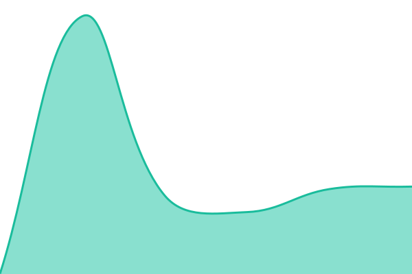
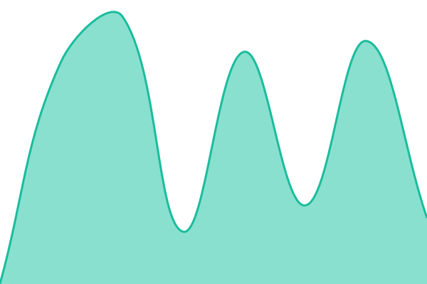

# [📈 Live Status](https://status.threaddesk.io): <!--live status--> **🟩 All systems operational**

This repository contains the open-source uptime monitor and status page for [GYB Commerce](https://gybcommerce.com), powered by [Upptime](https://github.com/upptime/upptime).

With [Upptime](https://upptime.js.org), you can get your own unlimited and free uptime monitor and status page, powered entirely by a GitHub repository. We use [Issues](https://github.com/GYBCommerce/threaddesk-status/issues) as incident reports, [Actions](https://github.com/GYBCommerce/threaddesk-status/actions) as uptime monitors, and [Pages](https://status.threaddesk.io) for the status page.

<!--start: status pages-->
<!-- This summary is generated by Upptime (https://github.com/upptime/upptime) -->
<!-- Do not edit this manually, your changes will be overwritten -->
<!-- prettier-ignore -->
| URL | Status | History | Response Time | Uptime |
| --- | ------ | ------- | ------------- | ------ |
|  [Dashboard & API](https://api.threaddesk.io/api/status/api) | 🟩 Up | [api.yml](https://github.com/GYBCommerce/threaddesk-status/commits/HEAD/history/api.yml) | 

 1060ms
     
 | 

<a href="https://status.threaddesk.io/history/api">100.00%</a>
    

|  [WhatsApp messaging](https://api.threaddesk.io/api/status/whatsapp) | 🟩 Up | [whatsapp.yml](https://github.com/GYBCommerce/threaddesk-status/commits/HEAD/history/whatsapp.yml) | 

 950ms
     
 | 

<a href="https://status.threaddesk.io/history/whatsapp">100.00%</a>
    

|  [Email delivery](https://api.threaddesk.io/api/status/email) | 🟩 Up | [email.yml](https://github.com/GYBCommerce/threaddesk-status/commits/HEAD/history/email.yml) | 

 947ms
     
 | 

<a href="https://status.threaddesk.io/history/email">100.00%</a>
    

|  [AI answers](https://api.threaddesk.io/api/status/ai) | 🟩 Up | [ai.yml](https://github.com/GYBCommerce/threaddesk-status/commits/HEAD/history/ai.yml) | 

 941ms
     
 | 

<a href="https://status.threaddesk.io/history/ai">100.00%</a>
    

|  [Automations](https://api.threaddesk.io/api/status/automations) | 🟩 Up | [automations.yml](https://github.com/GYBCommerce/threaddesk-status/commits/HEAD/history/automations.yml) | 

 294ms
     
 | 

<a href="https://status.threaddesk.io/history/automations">100.00%</a>
    

|  [Store integrations](https://api.threaddesk.io/api/status/integrations) | 🟩 Up | [integrations.yml](https://github.com/GYBCommerce/threaddesk-status/commits/HEAD/history/integrations.yml) | 

 939ms
     
 | 

<a href="https://status.threaddesk.io/history/integrations">100.00%</a>
    

|  [Website chat widget](https://api.threaddesk.io/widget/widget.js) | 🟩 Up | [widget.yml](https://github.com/GYBCommerce/threaddesk-status/commits/HEAD/history/widget.yml) | 

 941ms
     
 | 

<a href="https://status.threaddesk.io/history/widget">100.00%</a>
    

|  [Web app](https://app.threaddesk.io/logo-mark.svg) | 🟩 Up | [web-app.yml](https://github.com/GYBCommerce/threaddesk-status/commits/HEAD/history/web-app.yml) | 

 329ms
     
 | 

<a href="https://status.threaddesk.io/history/web-app">100.00%</a>
    

|  [Website](https://threaddesk.io) | 🟩 Up | [website.yml](https://github.com/GYBCommerce/threaddesk-status/commits/HEAD/history/website.yml) | 

 174ms
     
 | 

<a href="https://status.threaddesk.io/history/website">100.00%</a>
    

<!--end: status pages-->

[**Visit our status website →**](https://status.threaddesk.io)

## 📄 License

- Powered by: [Upptime](https://github.com/upptime/upptime)
- Code: [MIT](./LICENSE) © [Anand Chowdhary](https://anandchowdhary.com)
- Data in the `./history` directory: [Open Database License](https://opendatacommons.org/licenses/odbl/1-0/)
